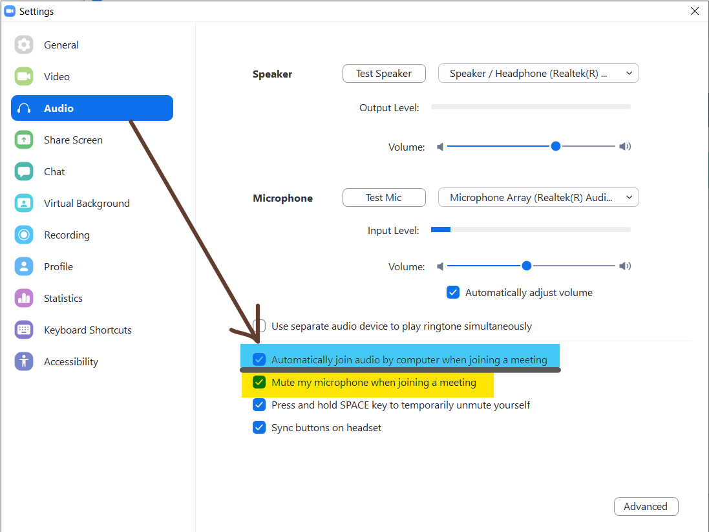
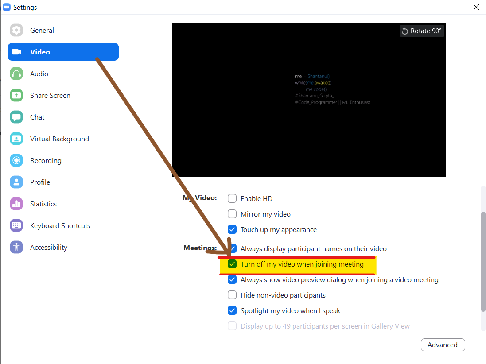

# Zoom-GMeet-Automation-Joiner

An Automation script to automatically join a scheduled zoom meeting at a specific time without manual labour. This one's for all the lazy people like me who don't like waking up too early for zoom classes by the college.

## Requirements 
- [x] Installed python version above 3.5
- [x] Installed pyautogui package
- [x] Installed schedule package
- [x] Updated Zoom Software (Signed in)

#### To install the above packages :
+ To [Download Python](https://www.python.org/downloads/)
+ `pip install pyautogui`
+ `pip install pandas`
+ `pip install webbrowser`

+ To [Download Zoom Software](https://zoom.us/download#client_4meeting)

## Setting up configurations :

#### Make sure the Zoom settings are as follows
##### Set the Audio Settings as follows :

###### Blue Highlight:
* It is an Optional Check for If you want to show in mid or according to sorting by roll number/Serial number Select this option
* If you don't select this option you'll be at bottom of the participant list
 
##### Set the Video Settings as follows :

# How to run the program :
##### Clone this repository and unzip it

* Make sure the All images conatain in `img` folder located in the same folder as `main.py`
* Run the `main.py` to run the program
* *Finally after the cmd is opened read the instructions thoroughly and proceed by entering your zoom meeting info*
* *Make sure you enter the "Meeting ID and Meeting Password" correctly or else the program would crash*
* Format for the Recurring Meeting Time should be in 24 Hour format
  * Eg: `09:30` for 9:30am and `15:30` for 3:30pm 
* Total Meeting time is entered in `minutes` format
  *Eg: `20` for 20mins
  
## For Slower computers/laptops :

+ By default, will work on most PCs without any error
+ Just in case, increase the timer 
+ Increase the time.sleep value until it matches your PC

## For any bugs/fixes:
##### Please create an issue in this repo and I'll try to fix it as soon as I can

## Any Contributions or Additions:
##### Please create a pull request and try to make this code better

## Upcoming:
- [ ] New GUI Interface for the inputs instead of CLI
- [ ] Better code with fewer dependencies
- [ ] Automation to create a task in the Task Scheduler for running the Script
- [ ] Replacing the need to always run the file in the background

# Have Fun Lazy People
_*Drop a ⭐ if you slept peacefully by this*_
